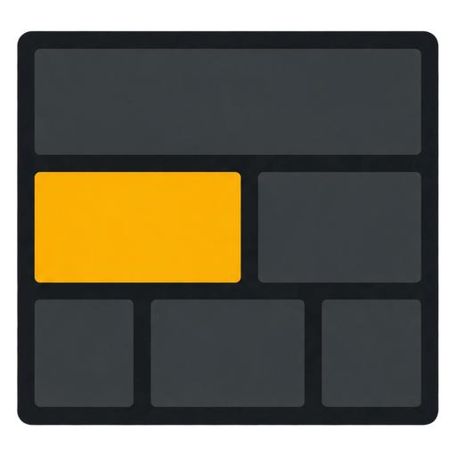
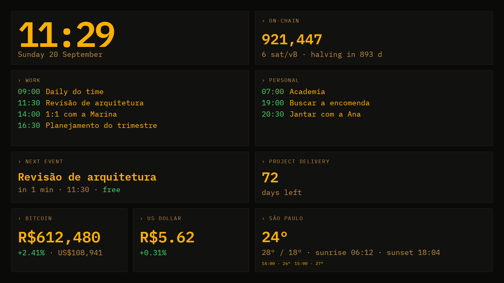
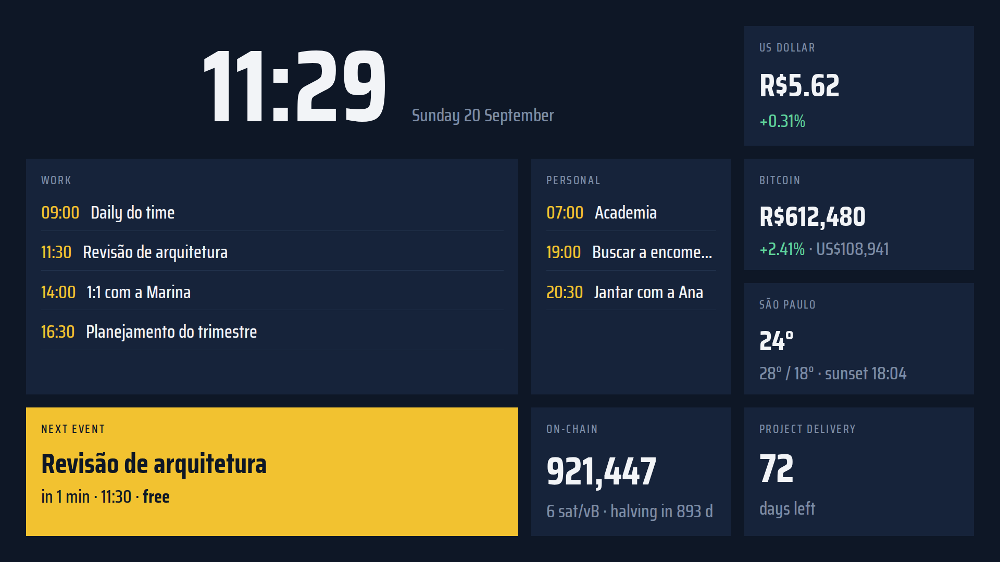
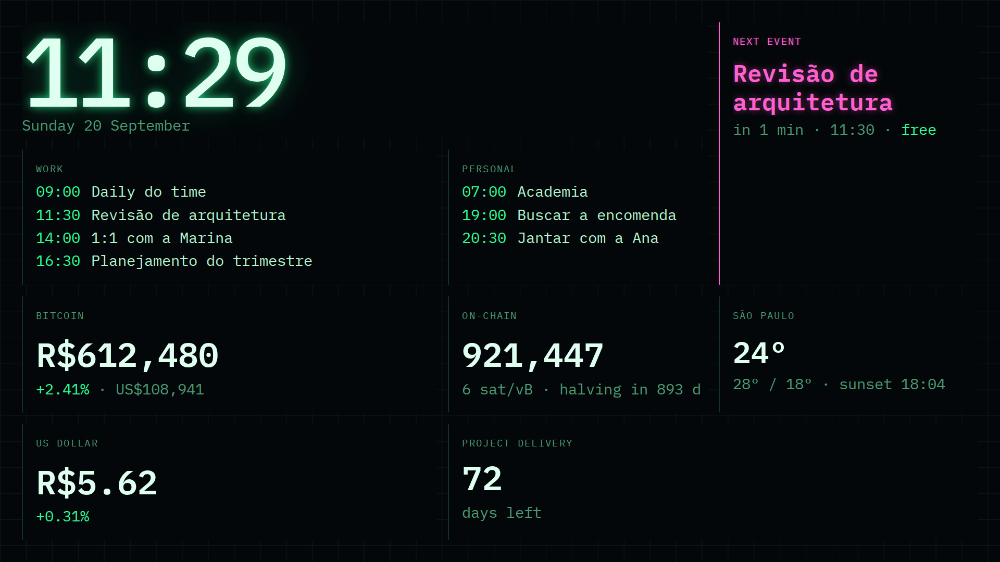
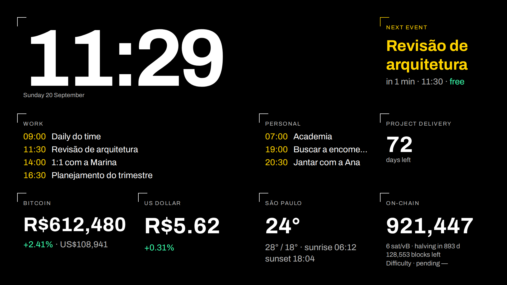
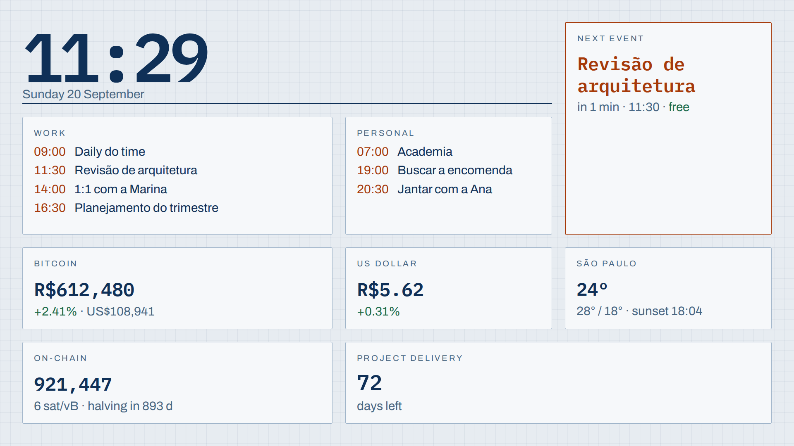
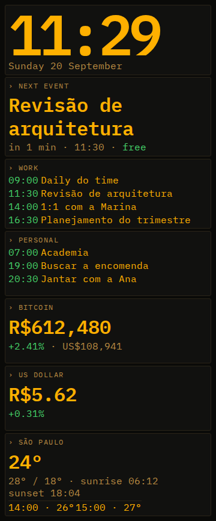

<p align="center">
  
</p>

<h1 align="center">Vitral</h1>

<p align="center">
  <strong>An always-on dashboard for a second screen: your calendar, Bitcoin, exchange rates and weather, refreshing itself.</strong>
</p>

<p align="center">
  <a href="#features">Features</a> •
  <a href="#requirements">Requirements</a> •
  <a href="#installation">Installation</a> •
  <a href="#themes">Themes</a> •
  <a href="#documentation">Docs</a>
</p>

<p align="center">
  
  
  
  
  
  
</p>

<br>

<p align="center">
  
</p>

<br>

Vitral is Portuguese for *stained glass window*: the screen is the window, each widget a pane
of glass, the data the light coming through, and the themes different windows fitted into
the same frame. Leave it on a second monitor, the living room TV, a tablet on the wall or a
Raspberry Pi, and it keeps itself up to date without anyone touching it.

## Features

✅ **Clock and date** — to the second, and it keeps running with no network

✅ **Two calendars** — work and personal side by side, from Google Calendar or any `.ics` feed

✅ **Next event** — featured, with a live countdown and free/busy status

✅ **Bitcoin** — in any currency your source supports, sats included with CoinGecko

✅ **Exchange rate** — rate and daily change

✅ **Weather** — now, high and low, the next hours, sunrise and sunset

✅ **Bitcoin on-chain** — block height, fee in sat/vB and the halving countdown

✅ **Countdowns** — to any dates you set

✅ **Interchangeable sources** — every widget has more than one data source, in the order you choose, with automatic fallback

✅ **Five themes** — full layouts, not palettes, from a 55" TV to an upright phone

✅ **Portuguese and English** — press `L` to switch; dates, numbers and currencies follow

✅ **Built to stay on** — pixel shifting against burn-in, screen wake lock, night dimming, and the last known value with its age when a source goes down

✅ **No keys, no signup** — with nothing configured, everything but the calendars shows real data

<br>

## Requirements

- **Docker** with the **Compose** plugin (`docker compose`, not the old `docker-compose`)
- Any 64-bit machine that runs Docker: the images are the official Node.js and nginx Alpine
  images
- **Port 8080** free (or any other, set in `.env`)
- **Internet access** from that machine, to reach the data sources
- On the screen, a current browser: Chrome or Edge 105+, Firefox 110+, Safari 16+

<br>

## Installation

**1. Get the code**

```bash
git clone https://github.com/diogofelixti/vitral.git
cd vitral
```

**2. Create your configuration**

```bash
cp config.example.yaml config.yaml
cp .env.example .env
```

Open `config.yaml` and set at least your city and time zone:

```yaml
timezone: America/Sao_Paulo
location: { latitude: -23.55, longitude: -46.63, label: "São Paulo" }
```

The rest (currencies, sources, countdowns, theme, night dimming) already has sensible
defaults. `.env` only holds the port and, if you use Google Calendar, its credentials.

**3. Start it**

```bash
docker compose up -d --build
```

**4. Open it**

Go to **http://localhost:8080** on the machine, or `http://<machine-address>:8080` from another
device on your network.

| Key | Action |
|---|---|
| `T` | next theme |
| `L` | Portuguese / English |
| `F` | full screen |

If `config.yaml` has a mistake, the `api` container keeps restarting and its log names the
field and the line: `docker compose logs api`.

### Calendars

Both calendars start empty and say so. The simplest way to fill one is your calendar's
**secret iCal address** (Google, Outlook, Proton, Apple and Nextcloud all have one), with no
credentials at all:

```yaml
calendars:
  personal: { provider: ics-url, url: "https://calendar.google.com/calendar/ical/.../basic.ics", label: { pt-BR: Pessoal, en: Personal } }
```

To use the Google Calendar API instead, follow [docs/google-calendar.md](docs/google-calendar.md).

### Updating and stopping

```bash
git pull && docker compose up -d --build   # update
docker compose down                        # stop
```

### Kiosk mode

On a machine dedicated to the screen, open the panel in full screen at startup, for example:

```bash
chromium --kiosk http://localhost:8080
```

<br>

## Themes

Press `T` to cycle. Every size is relative to the panel, so each theme fits any screen with
no adjustment.

<details>
<summary><strong>Terminal</strong> — CRT amber, monospace</summary>
<br>
<p align="center"></p>
</details>

<details>
<summary><strong>Estação</strong> — a departure board</summary>
<br>
<p align="center"></p>
</details>

<details>
<summary><strong>Neon</strong> — green phosphor and magenta</summary>
<br>
<p align="center"></p>
</details>

<details>
<summary><strong>Contraste</strong> — black-and-white HUD, readable across the room</summary>
<br>
<p align="center"></p>
</details>

<details>
<summary><strong>Cianótipo</strong> — technical drawing, the light one for a bright room</summary>
<br>
<p align="center"></p>
</details>

<details>
<summary><strong>On a phone</strong></summary>
<br>
<p align="center"></p>
</details>

A new theme is one CSS file, with no build step and no JavaScript: see
[docs/themes.md](docs/themes.md).

<br>

## Documentation

- 📅 [**Google Calendar**](docs/google-calendar.md) — OAuth setup, and why you probably want `ics-url` instead
- 🔌 [**Data sources**](docs/providers.md) — what each source covers, fallback, and how to add one
- 🎨 [**Themes**](docs/themes.md) — the theme contract, the grid and the rules
- 🤝 [**Contributing**](CONTRIBUTING.md) — development setup and guidelines

<br>

## Privacy and security

Everything runs on your machine. The backend talks directly to the sources you chose, with no
intermediary service, and the Google token stays in a local Docker volume, in a container
that publishes no port. Vitral asks only for **read** access to your calendar.

> ⚠️ **Vitral is built for your local network, not the internet.** There is no login and no
> HTTPS: anyone who can reach the port can read your calendar. For remote access, put it
> behind a VPN or an authenticating proxy.

<br>

## Contributing

Themes, data sources, widgets, translations and fixes are welcome. Start with
[CONTRIBUTING.md](CONTRIBUTING.md).

## License

[MIT](LICENSE)
